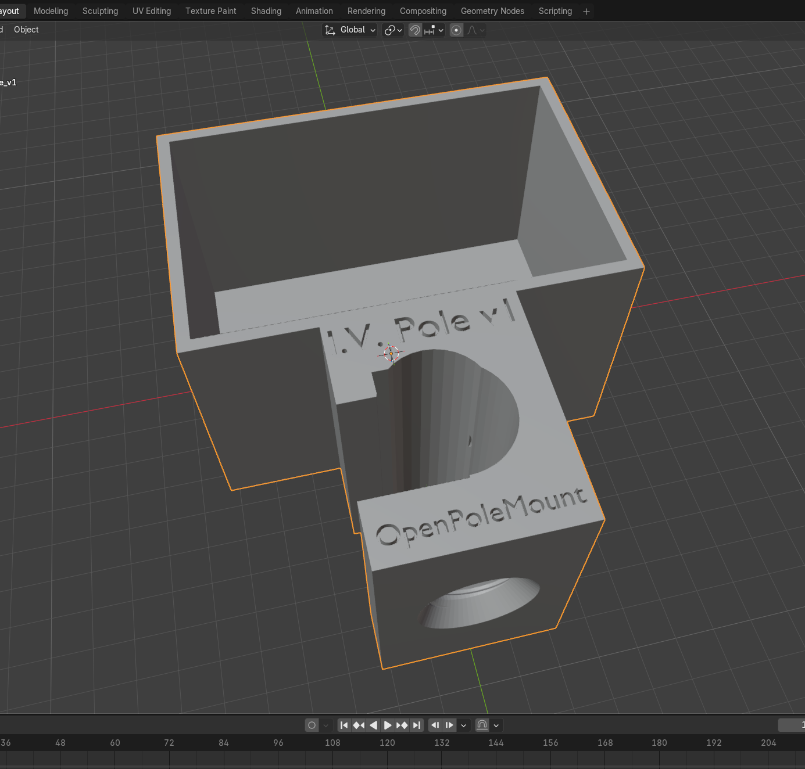

# OpenPoleMount

**The first fully 3D-printable IV pole mounting cradle for the Curlin CMS6000 infusion pump.**

---

!!! warning "Reference Design — Not a Medical Device"
    These files are provided for informational and educational purposes only.
    This design is not FDA-cleared or approved. You are responsible for
    verifying the mechanical integrity of any printed parts before use.
    [Read the full disclaimer →](safety.md)

---

## The Problem

Curlin CMS6000 IV pole mounting cradles are backordered. The bag alternative
sent by pharmacies requires a technique that only a few experienced nurses
can apply correctly. Many home-healthcare patients need a reliable, easy-to-use
mounting solution now.

## The Solution

An open-source 3D-printable cradle that any maker can print and any patient
can assemble. The mounting section is designed as the **OpenPoleMount block** —
a universal standard for any accessory on a standard home IV pole.

## Download

[Download STL Files (v1.1.0)](https://github.com/GoR-XarraY/openpolemount/releases/latest){ .md-button .md-button--primary }
[View on GitHub](https://github.com/GoR-XarraY/openpolemount){ .md-button }

## Available Variants

Two cradle shapes are available — choose whichever you prefer. Both use the same
thumbscrew, the same print settings, and the same assembly process.

| Variant | File | Shape |
|---|---|---|
| **IV Pole Mount v1** | `OpenPoleMount_IV-Pole_v1.stl` | Original shape — [Print Guide →](print-settings.md) |
| **IV Pole Mount v2** | `OpenPoleMount_IV-Pole_v2.stl` | Revised exterior shape — [Print Guide →](iv-pole-v2/print-settings.md) |
| **Thumbscrew** (both variants) | `thumbscrew_v14_flat_Thandle.stl` | T-handle, flat grip |

## Getting Started

1. **Choose your shape** — [v1](print-settings.md) or [v2](iv-pole-v2/print-settings.md)
2. **[Assembly →](assembly.md)** — step-by-step mounting instructions (same for both variants)
3. **[Safety & Disclaimer →](safety.md)** — read before use

## Designed For

| Component | Description |
|---|---|
| Pump | Curlin CMS6000 Infusion Pump |
| Pole | Standard home IV pole (~25mm / 1 inch diameter) |
| Attachment | Printed thumbscrew (included in download) |

## Open Source

All designs are released under [CERN-OHL-W-2.0](https://cern-ohl.web.cern.ch/) —
modifications to these designs must stay open source. Documentation is under
[CC-BY-SA-4.0](https://creativecommons.org/licenses/by-sa/4.0/).

**[Contribute a new accessory →](contributing.md)**

---

*OpenPoleMount is not affiliated with Curlin Medical, Smiths Medical, or any IV pump manufacturer.*
