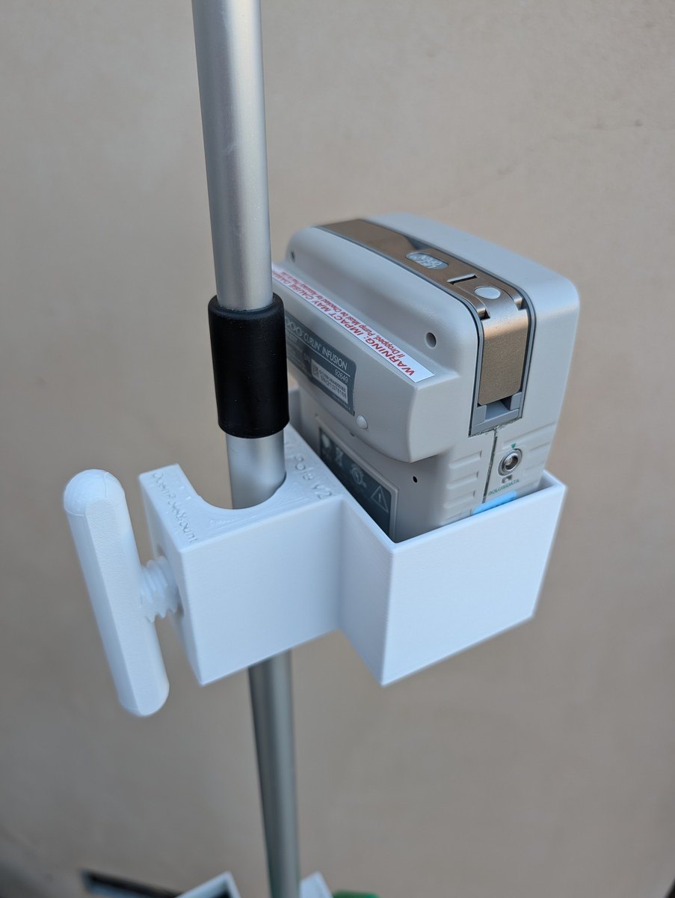

# IV Pole Mount v2

**A revised shape for the OpenPoleMount IV pole cradle — same pump, same specs, different look.**

*OpenPoleMount IV Pole v2 — 3D render. U-shaped pole channel at right, pump cradle at left, embossed labels.*

---

!!! info "V2 vs V1 — What Changed"
    The v2 body has a **different exterior shape** from v1. All functional dimensions are identical:
    same pole channel, same pump cradle pocket, same M20 thumbscrew thread.
    Both versions use the same thumbscrew (`thumbscrew_v14_flat_Thandle.stl`) and have
    identical print settings, assembly steps, and strength characteristics.

## Printing Footage

  <iframe width="315" height="560"
    src="https://www.youtube.com/embed/z05xgJhH_BQ"
    title="OpenPoleMount IV Pole V2 — printing the first one"
    frameborder="0"
    allow="accelerometer; autoplay; clipboard-write; encrypted-media; gyroscope; picture-in-picture"
    allowfullscreen>
  </iframe>

## Installed Photos

  

    
    
Front — pump fully seated, keypad accessible

  

  

    
    
3/4 angle — pump in cradle, IV tubing routed

  

  

    
    
Rear — green T-handle thumbscrew on pole

  

  

    
    
Thumbscrew detail — hand-tighten only

  

### Curlin CMS6000 — More Views

  

    
    
Curlin CMS6000 — front view, pump fully seated

  

  

    
    
Curlin CMS6000 — straight-on, keypad fully visible

  

  

    
    
Side — cradle body and pole channel visible

  

  

    
    
Overhead angle — pump seated in cradle pocket

  

### MOOG Pump Compatibility

  

    
    
MOOG pump — front-left, thumbscrew engaged

  

  

    
    
MOOG pump — front-right angle

  

  

    
    
MOOG pump — top-down, pump seated securely

  

### Cradle Detail — Empty

  

    
    
Empty cradle — open front shows the pocket shape

  

  

    
    
Side — thumbscrew threaded through pole channel

  

  

    
    
Top-down — "I.V. Pole v2" label embossed on body

  

  

    
    
Rear — U-shaped pole channel and cradle walls

  

  

    
    
Channel detail — thumbscrew seats flush against pole

  

---

  

    
🖨️ Print It Yourself — Free

    
Download and print on any FDM printer.

    <a href="print-settings.md" style="display:inline-block;padding:0.4rem 1rem;background:var(--md-primary-fg-color);color:white;border-radius:4px;text-decoration:none;font-size:0.875rem;font-weight:600;">Print Guide →</a>
  

  

    
📦 Order Pre-Printed — $25 + shipping

    
Get it printed and shipped — no printer needed.

    <a href="../order.md" style="display:inline-block;padding:0.4rem 1rem;background:#2e7d32;color:white;border-radius:4px;text-decoration:none;font-size:0.875rem;font-weight:600;">Order Now →</a>
  

## Next Steps

1. **[Print Guide →](print-settings.md)** — settings, orientation, checklist
2. **[Assembly →](assembly.md)** — step-by-step with photos
3. **[Safety & Disclaimer →](../safety.md)** — read before use
