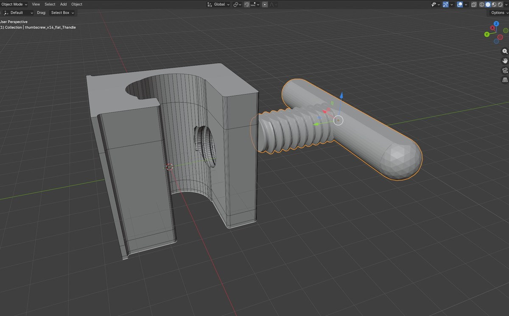

# The OpenPoleMount Mounting Block — v1

**The foundation of the whole project.** Every OpenPoleMount design — the v3
cradle, the v2 universal holder, and every future accessory — is built on top of
this one part: the **Pole Mounting Block**. It is the piece that actually clamps
to a standard home IV pole, and it defines the shared interface everything else
attaches to.

*The Pole Mounting Block v1 with its T-handle thumbscrew — the U-shaped channel wraps a standard IV pole and the printed thumbscrew clamps it in place.*

---

!!! info "This is a base component, not the current cradle"
    If you're here to **print an equipment cradle**, you want the
    [**v3 cradle**](../iv-pole-v3/index.md) (the current design) — the mounting
    block is already built into it. This page documents the block **on its own**,
    as the shared foundation for the project and for people designing their own
    accessories.

!!! warning "Reference Design — Not a Medical Device"
    These files are provided for informational and educational purposes only. This
    is not an FDA-cleared or approved product. It is a load-bearing part; you are
    responsible for verifying the mechanical integrity of anything you print before
    use. [Read the full disclaimer →](../safety.md)

## Why it exists

Rather than redesign a pole clamp for every accessory, OpenPoleMount treats the
pole attachment as **one reusable primitive**. Design any holder, tray, or mount
so it sits on the block, and it inherits a known, tested way of attaching to a
standard home IV pole — and it becomes compatible with everything else in the
system. This is what makes OpenPoleMount an *open hardware platform* rather than a
single part:

- **Users** print one mounting approach and understand it once.
- **Contributors** design to a consistent, documented interface.
- **The ecosystem** grows every time someone adds an accessory to the same block.

## Download the files

!!! danger "Load-bearing part — read the print guide first"
    The block carries the full weight of equipment and a filled IV bag through a
    single thumbscrew clamp. Wall count and infill are **safety-critical**. Use the
    [shared print settings](../iv-pole-v3/print-settings.md) (PLA, 6 walls, 2 mm
    top/bottom, ≥35 % non-concentric infill) as the minimum.

| File | Purpose | Qty |
|---|---|---|
| [`OpenPoleMount_Pole_Mounting_Block_V1.stl`](https://github.com/GoR-XarraY/openpolemount/raw/main/stl/OpenPoleMount_Pole_Mounting_Block_V1.stl) | The mounting block (pole clamp + accessory interface) | 1 |
| [`OpenPoleMount_Pole_Mounting_Block_ThandleThumbscrew-V1.stl`](https://github.com/GoR-XarraY/openpolemount/raw/main/stl/OpenPoleMount_Pole_Mounting_Block_ThandleThumbscrew-V1.stl) | Printed T-handle thumbscrew that clamps the block to the pole | 1 |

The published geometry is the STL meshes above, remixable under the hardware
license. Editable source exports (STEP) are being prepared for the repository's
[`source/`](https://github.com/GoR-XarraY/openpolemount/tree/main/source) folder —
if you need them sooner, [open an issue](https://github.com/GoR-XarraY/openpolemount/issues).

## Dimensions

Overall printed footprint, measured directly from the STL geometry:

| Part | Bounding size (X × Y × Z) |
|---|---|
| Pole Mounting Block v1 | **48.0 × 57.9 × 59.5 mm** |
| T-handle Thumbscrew v1 | **102.0 × 53.0 × 16.0 mm** (T-handle across × head × thickness) |

!!! note "Formal interface spec — pending"
    The exact **accessory-mating dimensions** (bolt/boss pattern, thumbscrew
    thread pitch, and the pole-channel diameter range) are what a contributor needs
    to design a guaranteed-compatible accessory. Those are being documented from the
    source CAD and are **not yet published as a formal tolerance spec** — the
    numbers above are the outer bounding box only. If you want to start designing an
    accessory now, [open an issue](https://github.com/GoR-XarraY/openpolemount/issues)
    and we'll share the working interface dimensions directly.
    *(Pending George's confirmation before this can be published as an official spec.)*

## Printing it

The block prints on the same conservative, PLA-validated settings as the rest of
the design family — see the **[shared print guide](../iv-pole-v3/print-settings.md)**.
Print the block with the pole channel vertical so the layer lines run
perpendicular to the clamping load, and print the T-handle thumbscrew flat, handle
face down, no supports required.

!!! warning "Testing status"
    The published [destruction testing](../testing.md) was performed on the
    v1/v2 cradle body, which uses this same block and thumbscrew interface. The
    block's clamp geometry is therefore covered by that testing, but the block has
    not been separately logged as its own test article. Treat the shared minimums as
    a floor and inspect every print before use. *(Pending George's standalone
    block test log before this is stated as an independent tested claim.)*

## Building on the block

Designing an accessory? Start from this part, keep the pole-channel and thumbscrew
interface unchanged, and add your holder on top. See
[Contributing](../contributing.md) and the
[Accessories](../accessories/index.md) page — anything built to this block works
with every OpenPoleMount cradle.

!!! tip "License note — you keep your accessory; just keep block changes open"
    The block is licensed **CERN-OHL-W-2.0 (weakly reciprocal)**. In practice: if
    you **modify the block itself**, your modified block must stay open under the
    same license. But a **separate accessory** you design to sit on top of the
    block does **not** have to be open — you can license your own add-on however
    you like. Improve the foundation in the open; your accessory stays yours.
