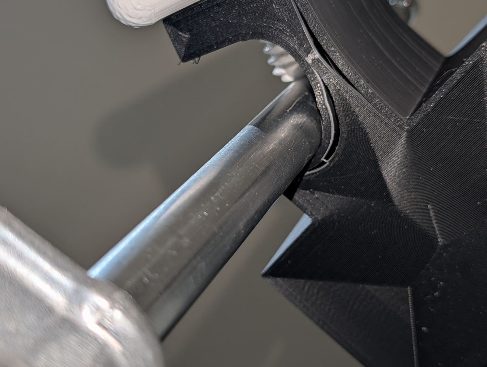

# Strength Testing

!!! info "Scope of this testing"
    This destruction testing was performed on the v1/v2 cradle body shape. The
    v3 pocket (smaller, more form-fitted to the Curlin CMS6000) shares the same
    pole channel, thumbscrew boss, and wall construction method, but **has not yet
    been separately tested to failure**. See the
    [v3 Print Guide](iv-pole-v3/print-settings.md) for current status.

## Summary

OpenPoleMount v1 was tested to destruction on 2026-06-09 using a deliberately under-spec print.
**The mount never failed under load.** When pushed far beyond any realistic use to find the
failure point, the failure mode was safe and predictable — and crucially, **the broken mount
continued to hold on the pole after failure.**

---

## Test Print Settings

These settings are **intentionally below the recommended minimums** — the goal was to find
the failure point of a worst-case print.

| Parameter | Test value | Recommended minimum |
|---|---|---|
| Material | Standard PLA | PLA |
| Wall count | 4 layers | 2 mm |
| Top/bottom | 1 mm | 2 mm |
| Infill | 15%, non-structural pattern | 15%, 3D honeycomb |

---

## Test 1 — Thumbscrew Over-Tightening to Failure

**Video:** `PXL_20260609_072444167.mp4`

The mount is clamped to a test rig with a chrome rod through the pole channel.
The thumbscrew is progressively tightened far beyond the hand-tight + quarter-turn
instruction — sustaining deliberate force well past any normal use.

The video shows the failure sequence in real time:

1. The mount holds firmly through all normal tightening levels
2. Continued extreme force initiates a crack at the thumbscrew hole in the side wall
3. The crack propagates through the wall as over-tightening continues
4. The thumbscrew punches through the side wall at the point of failure

The **pole channel and cradle body remain completely intact throughout.** Only the
side wall at the thumbscrew hole fails, and only under sustained force that no
user would apply in normal operation.

*Mount on test rig before failure — chrome rod through pole channel, thumbscrew being tightened*

*Crack initiating and propagating at the thumbscrew hole during extreme over-tightening*

*Thumbscrew engagement zone — close-up showing wall stress during tightening*

*End state: thumbscrew has punched through the side wall. Pole channel intact.*

---

## Test 2 — Broken Mount Still Holds

**Video:** `PXL_20260609_072737644.mp4`

After the side wall failure in Test 1, the broken mount was left on the pole and tested
for continued grip. This is the most important finding of the test session.

**With the thumbscrew hole completely torn open, the mount continued to hold on the pole.**

The video shows the broken cradle being pushed, pulled, and loaded on the pole. Despite
the visible damage to the side wall, the pole channel geometry maintains grip. The mount
does not slide or release. A load can still be hung from it.

This demonstrates two critical properties of the design:

1. **Failure is visible and obvious** — a broken mount looks broken. There is no hidden
   or gradual weakening that could go undetected.
2. **Failure is not catastrophic** — the broken mount retains residual grip. A pump
   hanging from a failed mount would not suddenly drop; there would be time to
   notice and address the problem.

---

## Key Findings

### The design has a generous safety margin
A deliberately under-spec print — well below recommended minimums — survived all normal
use conditions without any failure. The recommended settings provide meaningful additional
margin above even this worst-case baseline.

### The failure mode is safe
When the mount does fail (under extreme, sustained over-tightening):
- Failure is localised to the thumbscrew side wall only
- The pole channel remains intact
- The failure is immediately visible
- The mount retains residual grip after failure

### Over-tightening is the only realistic failure path
Normal hand-tightening cannot reach the force levels required to cause failure.
The failure in testing required sustained deliberate force far beyond what is needed
to securely mount the cradle. **Do not over-tighten.** See [Assembly Guide](assembly.md).

---

## What This Means for the Recommended Settings

Our [recommended settings](print-settings.md) (6 walls, 2 mm top/bottom, 35% 3D honeycomb)
are conservative relative to these tested limits. The conservatism is intentional:

- Print quality varies between printers and operators
- PLA quality varies between brands and batches
- A 2× wall thickness margin accounts for real-world variation

Printing at or above the recommended settings gives significant margin beyond what was
already demonstrated to survive in this test.

---

## Videos

### Test 1 — Thumbscrew Breaking the Mount

Shows the mount being tightened to destruction in real time — crack initiation at the thumbscrew
hole, propagation through the side wall, and the final punch-through. The pole channel and cradle
body remain intact throughout.

  <iframe width="315" height="560"
    src="https://www.youtube.com/embed/OXBP-LRRCT0"
    title="OpenPoleMount — Test 1: Thumbscrew Breaking the Mount"
    frameborder="0"
    allow="accelerometer; autoplay; clipboard-write; encrypted-media; gyroscope; picture-in-picture"
    allowfullscreen>
  </iframe>

### Test 2 — Broken Mount Still Holds

After the side wall failure in Test 1, the broken mount is left on the pole and loaded.
Despite the thumbscrew hole being completely torn open, the pole channel geometry maintains grip —
the mount does not slide or release. Confirms the design's safe, residual-hold failure mode.

  <iframe width="315" height="560"
    src="https://www.youtube.com/embed/5i2bdpntpkQ"
    title="OpenPoleMount — Test 2: Broken Mount Still Holds"
    frameborder="0"
    allow="accelerometer; autoplay; clipboard-write; encrypted-media; gyroscope; picture-in-picture"
    allowfullscreen>
  </iframe>

---

*Testing conducted by the OpenPoleMount project creator, 2026-06-09.*  
*This testing is provided for informational purposes only and does not constitute*
*engineering certification or safety approval. See [Safety & Disclaimer](safety.md).*
