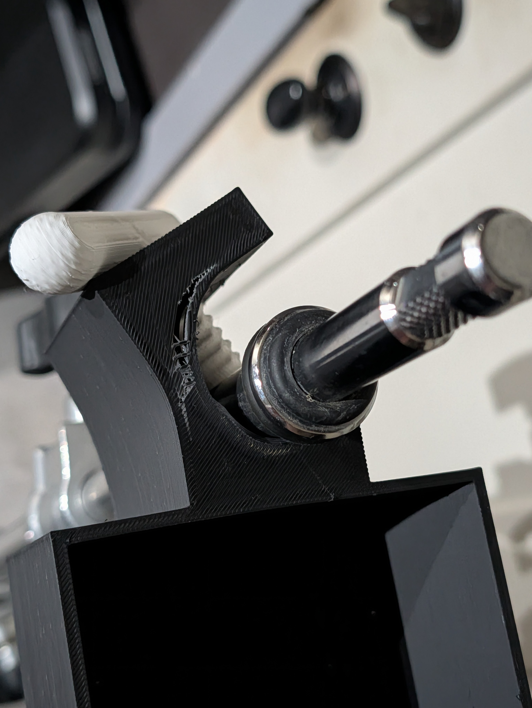
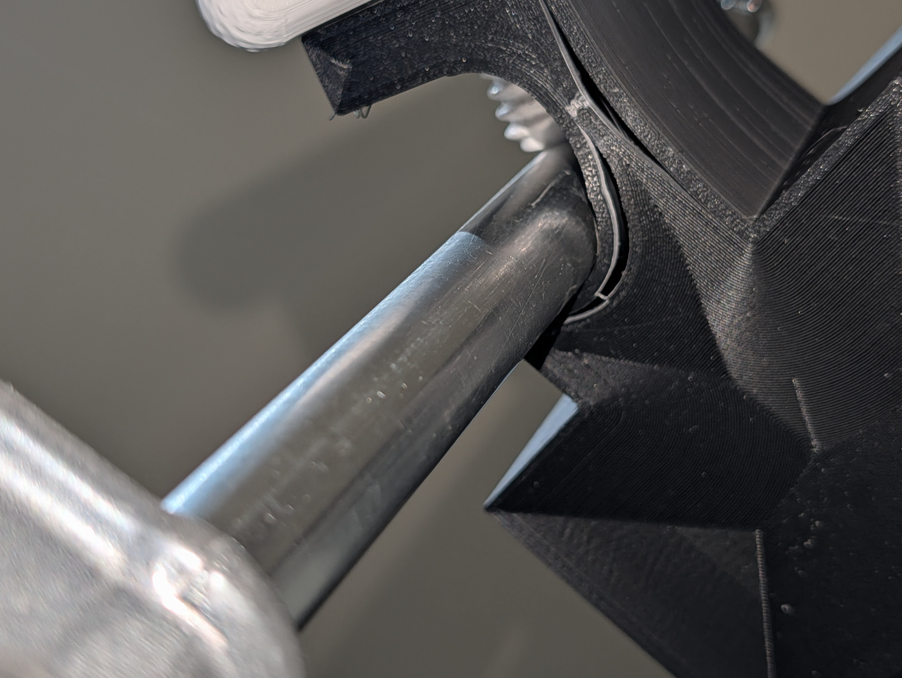
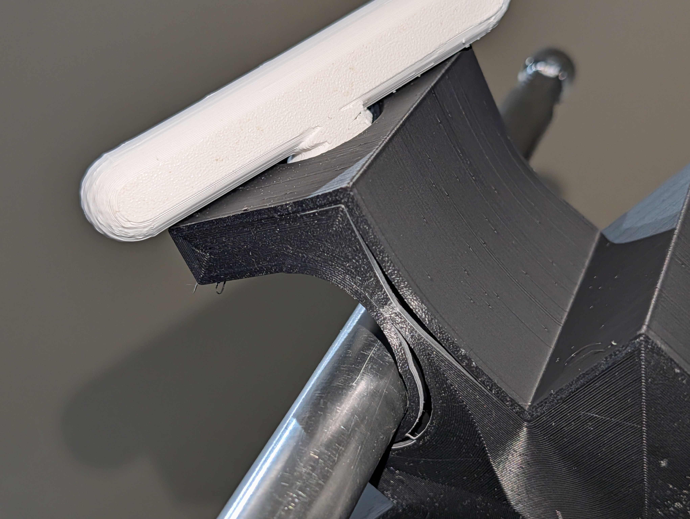
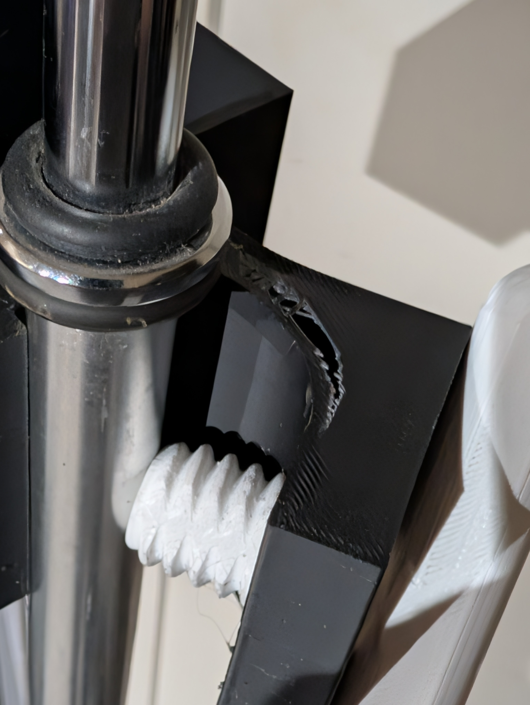

# Strength Testing

## Summary

OpenPoleMount v1 was tested to destruction on 2026-06-09. **The mount never failed under load.**
The only failure occurred during deliberate extreme over-tightening of the thumbscrew far beyond
any normal or reasonable use — confirming that the design has a safe, predictable failure mode
rather than a sudden structural collapse.

---

## Test Conditions

| Parameter | Value |
|---|---|
| Material | Standard PLA |
| Wall count | 4 layers (below 2 mm minimum recommendation) |
| Top/bottom | 1 mm (below 2 mm minimum recommendation) |
| Infill | 15%, non-structural pattern |
| Infill type | Non-concentric (below 3D honeycomb recommendation) |

These settings are **intentionally below the recommended minimums** in the [Print Guide](print-settings.md).
The test was designed to find the failure point of an under-spec print.

---

## Results

**The mount held.** Under all normal use conditions — including hanging load, lateral force,
and firm hand-tightening — the print showed no failure, deformation, or slippage.

Failure occurred only when the thumbscrew was driven far beyond the point any user
would reach by hand in normal operation.

### Failure Mode

When pushed to destruction by extreme over-tightening, the **thumbscrew punched through
the side wall of the cradle** at the thumbscrew hole. The cradle body and pole channel
remained intact. This is the expected and acceptable failure mode:

- Failure is visible and obvious — the part doesn't suddenly drop
- The pump would remain in the cradle pocket even after this failure
- A user tightening by hand cannot reach this force level with normal effort

*Test setup: mount clamped to test rig with chrome rod through pole channel*

*Thumbscrew engagement detail during load testing*

*Mount on pole under load — no deformation or slippage*

*Destruction result: thumbscrew tore through the side wall at extreme over-tightening.
Cradle body and pole channel remained intact.*

---

## What This Means for Print Settings

Our [recommended settings](print-settings.md) (2 mm walls, 2 mm top/bottom, 15% 3D honeycomb)
are deliberately **conservative relative to these tested limits**.

| Setting | Tested (survived) | Recommended |
|---|---|---|
| Wall thickness | 4 layers (~0.8–1.6 mm) | 2 mm |
| Top/bottom | 1 mm | 2 mm |
| Infill | 15%, non-structural | 15%, 3D honeycomb or non-concentric |
| Material | Standard PLA | PLA (tested) |

The recommendations exist because:

1. **Print quality varies** — a well-tuned printer at 4-layer walls may perform like a poorly-tuned printer at 2 mm walls
2. **Material varies** — bargain PLA has meaningfully lower layer adhesion than quality PLA
3. **The margin matters for medical-adjacent use** — conservative settings reduce variability

The tested under-spec print surviving gives confidence that the design has a generous safety margin
when printed at or above recommended settings.

---

## Tightening Guidance (Reinforced by Test)

The failure mode makes one thing clear: **over-tightening is the only realistic risk.**
Normal hand-tightening is safe. The mount can be tightened to destruction deliberately,
but this requires sustained effort well beyond what's needed to secure the cradle on a pole.

**Correct tightening:** hand-tight + one quarter-turn. The cradle should not slide down the pole under firm push. If it does, tighten slightly more — do not force.

See [Assembly Guide](assembly.md) for full tightening instructions.

---

## Videos

Destruction test videos (too large for GitHub — ~58 MB and ~130 MB) are available on request.
[Open an issue](https://github.com/GoR-XarraY/openpolemount/issues) if you'd like access.

*(Future: video will be linked from YouTube or attached to the release)*

---

*Testing conducted by the OpenPoleMount project creator, 2026-06-09.*  
*This testing is provided for informational purposes. See [Safety & Disclaimer](safety.md).*
